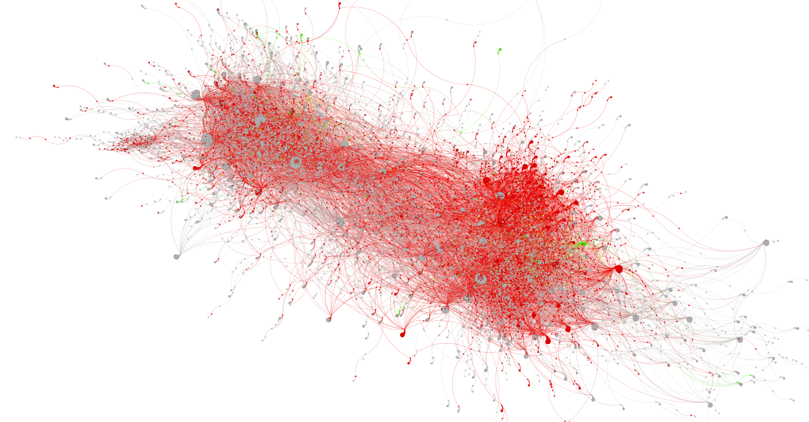
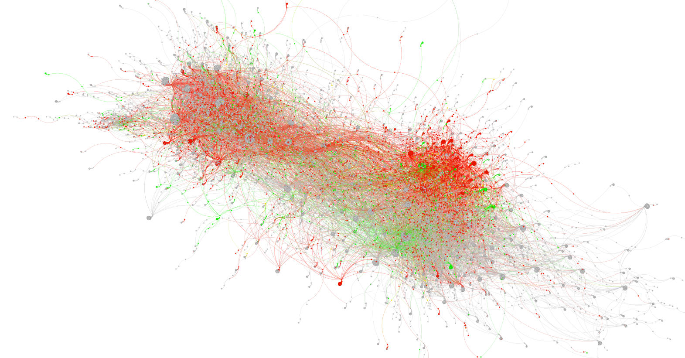
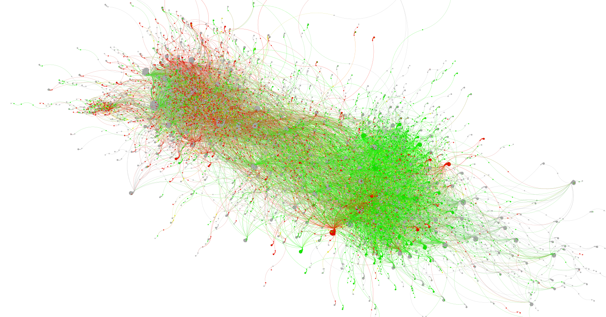

================

# Retweet Network Analysis of Public Stances on Luigi Mangione, Brian Thompson, and UnitedHealthcare

<!-- badges: start -->

<!-- badges: end -->

## 📚 Research Context

This analysis was created in connection with, but independent of, a
research project analyzing the public reaction to the murder of United
Healthcare CEO Brian Thompson currently being conducted by researchers
at The University of South Florida, University at Albany, and SUNY
Polytechnic Institute.

### Research Background:

Media reporting and public opinion polls following the assassination of
United Healthcare CEO Brian Thompson suggested a surprising degree of
support for the suspect Luigi Mangione, lack of empathy for the victim,
and antipathy towards the health insurance industry. The goal of our
project is to examine the social media discourse following the
assassination to examine key themes and conflicts in public discourse
that emerged on social media. This goal will be accomplish through
stance detection, topic modeling, and network and frame analysis.

This analysis, while independent of this greater project, relies on the
results from the Stance Detection portion and guidance from the leading
researcher of the study.

**Project Articles and Installments:** ***Human and AI Alignment on
Stance Detection: A Case Study of the United Healthcare CEO
Assassination***  
Presented at **FLAIR-38 Conference** in Florida, May 2025  
**Authors:** Dr. Loni Hagen, Alina Hagen, Daniel Tafmizi, Christopher
Reddish, Dr. Lingyao Li, Dr. Ashely Fox, Dr. Nicolau DePaula

***‘I don’t condone murder, but…’ Understanding the ambivalent social
media reaction to assassination of UnitedHealthcare CEO*** **Authors:**
Dr. Loni Hagen, Dr. Ashley Fox, Dr. Lingyao Li, Christopher Reddish,
Alina Hagen, Daniel Tafmizi, Dr. Nicolau DePaula

------------------------------------------------------------------------

## 📊 Data Informationa

This analysis’s data was collected using the X api through Brandwatch.
Due to X api developer restrictions, only the Post Id’s + calculated
stance labels are shared in the data folders.

The stance label determinations were during the ***Human and AI
Allignment on Stance Detection*** installment of this project, using
Open AI’s GPT 4.1 Mini Model. The Stance detection model was developed
by the researchers on this project to calculate input text stance
towards three different entities (Three stances (In-Favor, Neutral, and
Against) against three entities (Luigi Mangione, Brian Thompson, and
UnitedHealthcare))

------------------------------------------------------------------------

## 📈 Edgelists, Nodes, and Gephi

The stance detection outputs and the full dataset were used to generate
an edgelist and a corresponding nodes table for network analysis in
Gephi. The accompanying script (`Stance-Network Analysis Setup.R`)
performs the following steps:

1.  **Loads X (Twitter) data and stance detection results.**
2.  **Builds a retweet network edgelist** and computes PageRank scores
    for each user.
3.  **Merges stance detection outputs** (`lmdata`, `btdata`, `uhcdata`)
    with the dataset by URL and fills any missing stance values for
    duplicate tweets.
4.  **Reshapes the dataset** to combine both tweet authors and thread
    authors into a single “user” column, accounting for thread authors’
    influence in the conversation.
5.  **Removes rows with missing stance values.**

For each user, the script calculates: - Total appearances in the
dataset  
- The sum, average, and variance of stance values toward each entity

**Stance labels are then assigned as follows:**  
- **Positive average:** `_pos`  
- **Negative average:** `_neg`  
- **Average = 0 and variance = 0:** `_TrueNeutral` (always neutral)  
- **Average = 0 and variance \> 0:** `_Divided` (a mix of positive and
negative stances that cancel out)

The script outputs both the edgelist and nodes table containing only
users present in the top 50k edges. These files are exported as CSVs for
visualization in Gephi.

In Gephi, the **ForceAtlas2** algorithm was applied to arrange the
network graph, with **approximate repulsion enabled** to improve
performance for the large network (50k edges, 43,448 nodes). After
generating the layout, the graphs were **partitioned and colored** based
on each user’s stance label to visualize stance distributions for each
entity.

## 🎯 Final Network Graph Visualizations

### Stance Encoded UHC Retweet Network

<figure>

<figcaption aria-hidden="true">UHC Network</figcaption>
</figure>

### Stance Encoded Brian Thompson Retweet Network

<figure>

<figcaption aria-hidden="true">BT Network</figcaption>
</figure>

### Stance Encoded Luigi Mangione Retweet Network

<figure>

<figcaption aria-hidden="true">LM Network</figcaption>
</figure>

The BT network shows more distinct green and red clusters compared to
LM, where the green positive conversation dominates and red negativity
appears more scattered. This suggests that discussion around BT may be
more polarized, with users having more nuanced pro- and anti-BT
conversations. UHC appears significantly less polarized than even the LM
conversation, displaying an overwhelming red that indicates most users
are at a consensus in their negative framing of the health insurance
company

These observations align with the results of our Human and AI Alignment
on Stance Detection study, which found that Luigi Mangione had the
highest proportion of in-favor posts (20.9%), while Brian Thompson
(2.4%) and UnitedHealthcare (0.4%) had very low levels of support.

What is particularly interesting in the BT and LM network graphs is the
presence of regions that remain the same color regardless of the topic.
In both graphs, the top-left cluster consistently appears red, while the
bottom-right cluster remains green. This pattern suggests that, although
BT and LM are often discussed in a dichotomous way, some actors in the
conversation reject that binary framing – expressing sympathy and/or
discontent toward both the suspect and the victim regardless.
